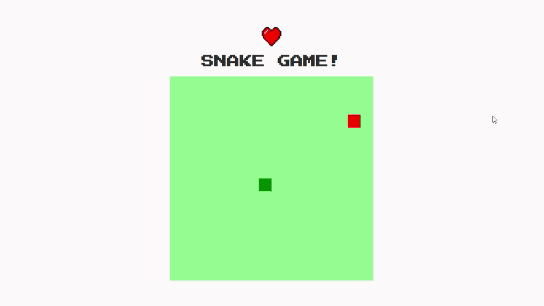

<h4 align="center">
 <b><h1>Snake Game < :heart: /> </h1></b> 
 
 


<b><h1>Snake Game :snake:</h1></b> 
<p align="justify"> Jogo da cobrinha utilizando javascript // Snake game in javascript </p>

## :desktop_computer:	 Tecnologias Utilizadas

- [HTML](https://html.com/)
- [CSS](https://purecss.io/)
- [JavaScript](https://www.javascript.com/)

## :books: Study

<p align="justify"> O <b>defer</b> atributo diz ao navegador para não esperar pelo script. Em vez disso, o navegador continuará a processar o HTML, criar DOM. O script carrega “em segundo plano” e, em seguida, é executado quando o DOM está totalmente construído. 
Ou seja, scripts <b>defer</b> nunca bloqueiam a página.</p>

```javascript
<script defer src="script.js"></script>
```

<p align="justify">
A <b>canvas</b> é uma tag html onde podemos desenhar elementos específicos, como formas geométricas e imagens, através de scrips, geralmente utilizando javascript. </p>

```html
<canvas id="snake" width="512" height="512"></canvas>
```

<h4 align="center">

